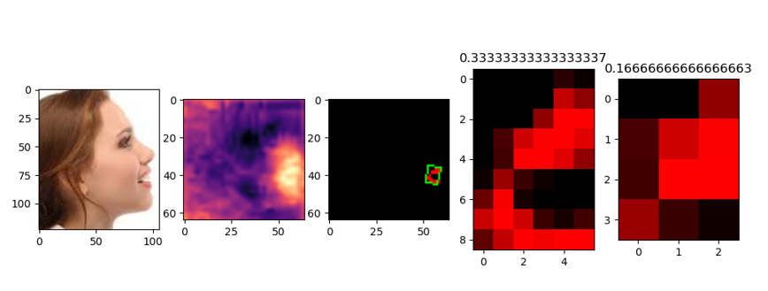
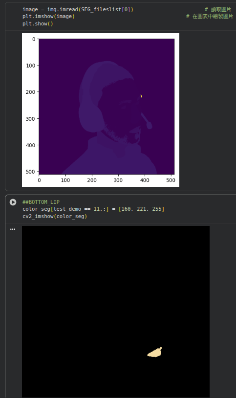

# Mouth Detector model

It's a computer vision model inference on human faces, to cropping the face area and then detect the 2 lips of mouth.
It would be provides the lips inside area, called as "mouthinside".  
 

## Usage

Currently, provided python and inference on one image only, to modified the image path in [inference_mouthinside.py](./inference_mouthinside.py)

**envs limits: python 3.8, tensorflow 2.2.0, openvino 2021.4**

## Data
utilizing with [Microsoft Synthetics](https://github.com/microsoft/FaceSynthetics),  totally 99,773 volumes.

### Data sampling
Parser the face area according to official guidance, every parts following to specific value:
- BACKGROUND = 0
- SKIN = 1
- NOSE = 2
- RIGHT_EYE = 3
- LEFT_EYE = 4
- RIGHT_BROW = 5
- LEFT_BROW = 6
- RIGHT_EAR = 7
- LEFT_EAR = 8
- **MOUTH_INTERIOR = 9**
- **TOP_LIP = 10**
- **BOTTOM_LIP = 11**
- NECK = 12
- HAIR = 13
- BEARD = 14
- CLOTHING = 15
- GLASSES = 16
- HEADWEAR = 17
- FACEWEAR = 18
- IGNORE = 255

Or, here's a sampling script to parsering the area of face, [parser_facesynthetics.ipynb](./parser_facesynthetics.ipynb) 
 

## Training framweork
Tensorflow keras with Unet, refer to an [introduction](https://github.com/veer2701/Image-Segmentation-with-U-Net/blob/main/6%20Image_segmentation_Unet_v2.ipynb)

## Testing results on public datasets
Need to updated

## Model conversion
Now, the version is trained done in 2021.11, and for edge inferrence, also provided openvino version.
Meanwhile, the version is too old to running on some framework nowtimes.

## ToDO
- [ ] Re-training with pytorch  
- [ ] Conversion to ONNX
- [ ] Evaluation of Public Datasets, IoU metrics

## Further
- [ ] C++, Video frames Analysis tools

## Reference
1. techniques, https://docs.opencv.org/3.4/dd/d49/tutorial_py_contour_features.html
2. techniques, https://docs.opencv.org/4.x/d9/d61/tutorial_py_morphological_ops.html
3. techniques, https://en.wikipedia.org/wiki/Dynamic_time_warping
4. techniques, [correlation adn convolution](https://www.spiedigitallibrary.org/conference-proceedings-of-spie/10452/104520Y/Teaching-the-concept-of-convolution-and-correlation-using-Fourier-transform/10.1117/12.2267976.full?SSO=1)
5. papers, [Effect of the output activation function on the probabilities and errors in medical image segmentation](https://arxiv.org/abs/2109.00903)
6. papers, [Determination of Hue Saturation Value (HSV)color feature in kidney histology image](https://iopscience.iop.org/article/10.1088/1742-6596/2157/1/012020/pdf)